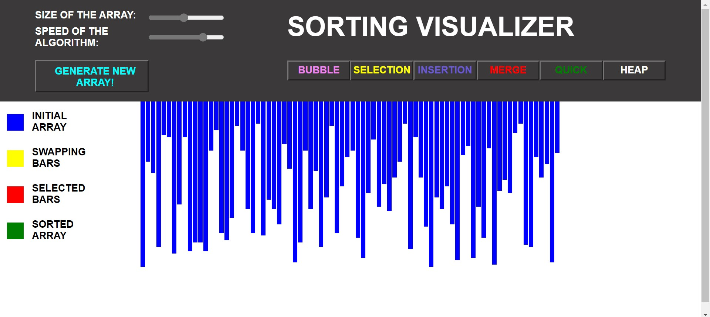

# Sorting Visualization

### Build a web application that enables users to visualize different complex algorithms with custom specifications and know them better.
# Sorting Algorithm Implemented
 * Bubble Sort
 * Selection Sort
 * Insertion Sort
 * Merge Sort
 * Quick Sort
 * Heap Sort

### This web site is built in <b>HTML, CSS, JavaScript.</b>
<a href=" https://laasya2005.github.io/Sorting-Visualizer/">Check Here</a>

